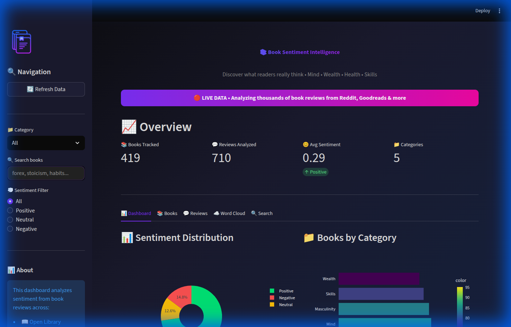

# 📚 Book Sentiment Intelligence

> **Discover what readers really think about books on Personal Development, Finance, Health, Philosophy, and more**

A comprehensive sentiment analysis platform that scrapes book reviews from multiple sources, analyzes sentiments, and provides personalized recommendations.



## 🌐 Live Dashboard

**[View Live Dashboard →](https://book-sentiment.streamlit.app)**

---

## ✨ Features

| Feature | Description |
|---------|-------------|
| **Multi-Source Scraping** | Open Library, Google Books, Reddit |
| **Sentiment Analysis** | VADER + TextBlob + Custom rules |
| **5 Categories** | Mind, Wealth, Health, Skills, Masculinity |
| **Word Clouds** | Visual representation of common themes |
| **Book Search** | Find books on any topic |
| **Top Reviews** | See highest-rated and most-discussed books |
| **SQLite Database** | Lightweight, portable storage |
| **Futuristic UI** | Dark theme with gradient accents |

---

## 📁 Categories

| Category | Topics |
|----------|--------|
| 🧠 **Mind** | Personal Development, Psychology, Stoicism, Philosophy |
| 💰 **Wealth** | Finance, Investing, Business, Trading |
| 🏃 **Health** | Fitness, Nutrition, Mental Health, Longevity |
| 🛠️ **Skills** | Productivity, Leadership, Communication, Habits |
| 🦁 **Masculinity** | Self-Improvement, Confidence, Relationships |

---

## 📚 Featured Books

- **The Rational Male** - Rollo Tomassi
- **No More Mr Nice Guy** - Robert Glover
- **The Way of the Superior Man** - David Deida
- **12 Rules for Life** - Jordan Peterson
- **The Obesity Code** - Jason Fung
- **Outlive** - Peter Attia
- **Atomic Habits** - James Clear
- **The Intelligent Investor** - Benjamin Graham
- **Man's Search for Meaning** - Viktor Frankl
- **Meditations** - Marcus Aurelius

---

## 🚀 Quick Start

```bash
# Clone the repository
git clone https://github.com/gondamol/book-sentiment-analysis.git
cd book-sentiment-analysis

# Create virtual environment
python3 -m venv venv
source venv/bin/activate

# Install dependencies
pip install -r requirements.txt

# Run the scraper
python scripts/scrape_books.py

# Run sentiment analysis
python scripts/analyze_sentiment.py

# Start the dashboard
streamlit run dashboard/app.py
```

---

## 🗂️ Project Structure

```
book-sentiment-analysis/
├── dashboard/
│   └── app.py              # Streamlit dashboard
├── scripts/
│   ├── scrape_books.py     # Multi-source book scraper
│   └── analyze_sentiment.py # Sentiment analysis pipeline
├── data/
│   ├── raw/                # Scraped JSON backups
│   ├── processed/          # Sentiment results
│   └── books.db            # SQLite database
├── .github/
│   └── workflows/          # GitHub Actions
├── .streamlit/
│   └── config.toml         # Theme config
├── requirements.txt
└── README.md
```

---

## 🔧 Technology Stack

| Category | Technology |
|----------|------------|
| **Backend** | Python, SQLite |
| **Scraping** | Requests, BeautifulSoup |
| **NLP** | VADER, TextBlob |
| **Visualization** | Streamlit, Plotly, WordCloud |
| **Deployment** | Streamlit Cloud |
| **Automation** | GitHub Actions |

---

## 📊 Data Sources

| Source | Type | Auth Required |
|--------|------|---------------|
| **Open Library** | API | ❌ No |
| **Google Books** | API | ❌ No |
| **Reddit** | Public JSON | ❌ No |

---

## 👤 Author

**Nicodemus Werre Amollo**
- Website: [gondamol.github.io](https://gondamol.github.io)
- LinkedIn: [linkedin.com/in/amollow](https://linkedin.com/in/amollow)
- Email: nichodemuswerre@gmail.com

---

## 📝 License

MIT License - Feel free to fork and improve!

---

*Built with ❤️ for readers who want to make better choices*
